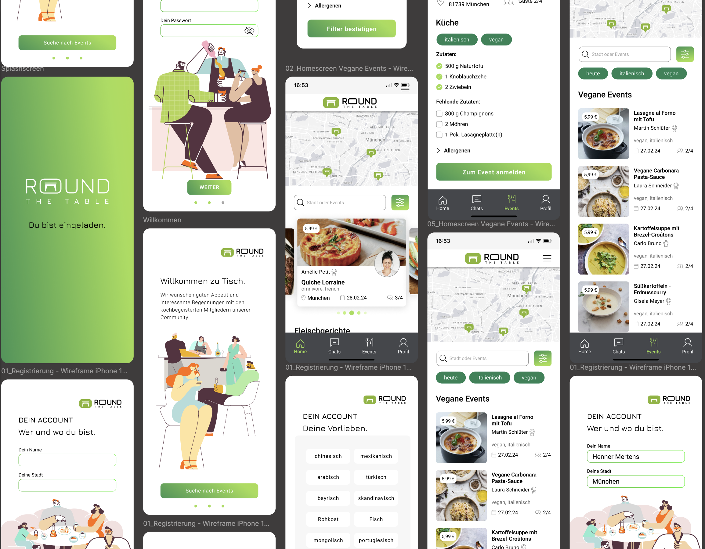

# Round the Table 🍽️  

## 🎯 Project Description  
This app was designed as a UX/UI project to connect people through shared meals. Many individuals eat alone—either because they have no one to share a meal with or because grocery portions are too large for single households.  

**Round the Table** helps solve this by allowing users to create cooking events where they invite guests to join them for a meal. Guests can sign up and contribute missing ingredients, fostering social connections and reducing food waste.  

This project was developed as part of a **one-week UX/UI design sprint**. Due to the limited timeframe, we focused on the most essential core functions to present a user-friendly concept.  

## 📝 Features  
✅ Create cooking events with date, time, and location  
✅ Specify the dish and missing ingredients  
✅ Guests can sign up and bring missing ingredients  
✅ Map view with available events  

## 📌 Screenshots  
  

## 🔗 Figma Prototype  
[Click here to view the prototype in Figma](https://www.figma.com/design/VHHiXFAeIbC1bkHZZdRt1z/Gruppenprojekt?node-id=0-1&t=8aslxpDJ3SIiSeei-1)  

## ✨ Design Decisions  
- Focus on essential features for a seamless user experience  
- Simple event creation for quick participation  
- Filtering options (e.g., dietary preferences like vegan)  
- Map view for easy event discovery  
- Community-driven approach to encourage social dining  

---  
Since this project was completed within a week, the focus was on creating a strong foundation that can be further developed if needed.
